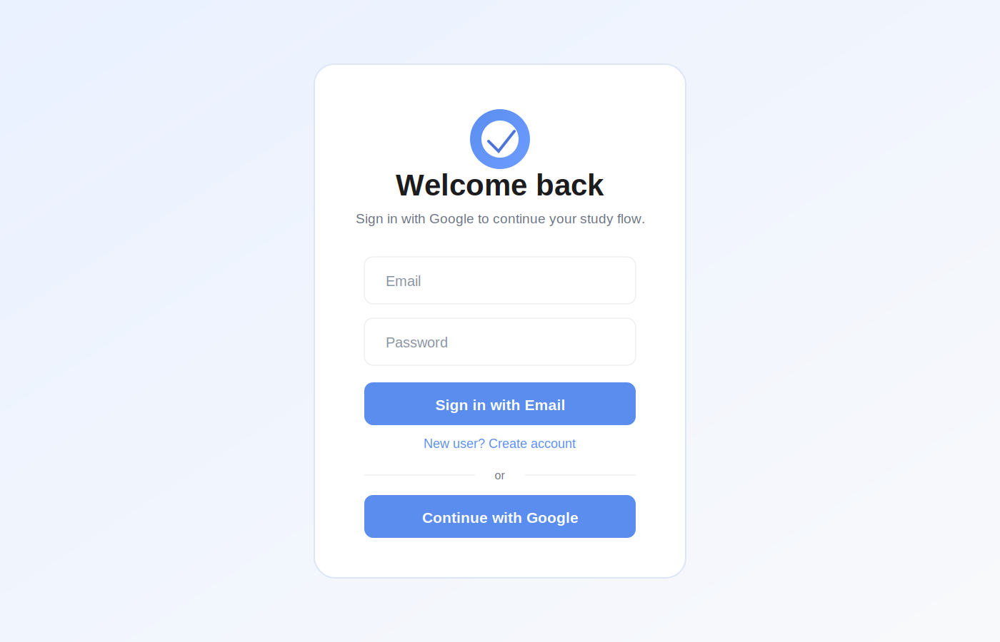
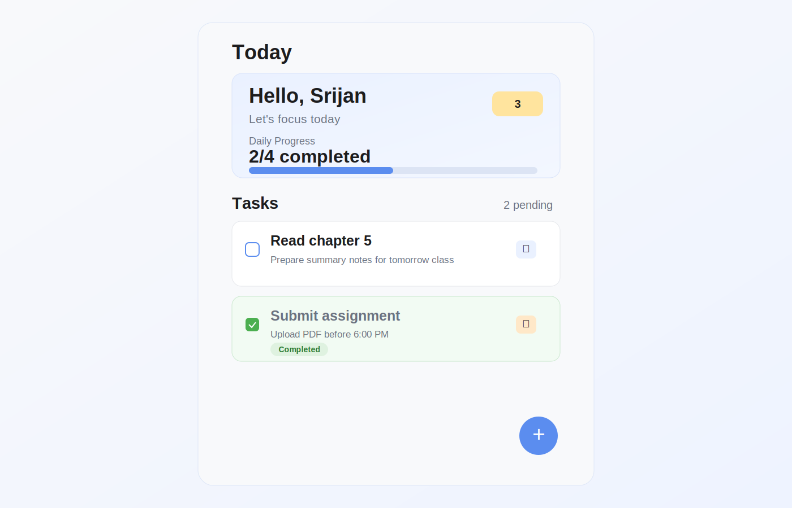
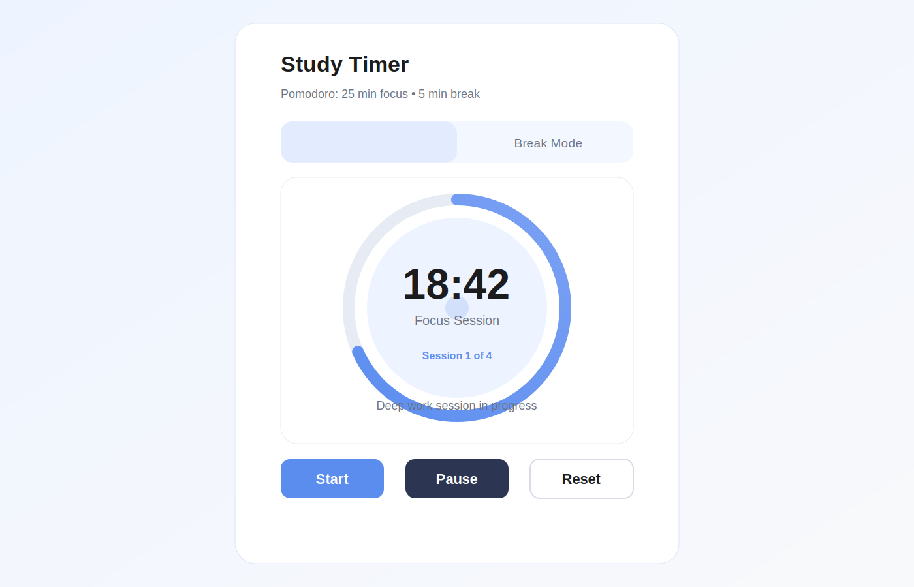
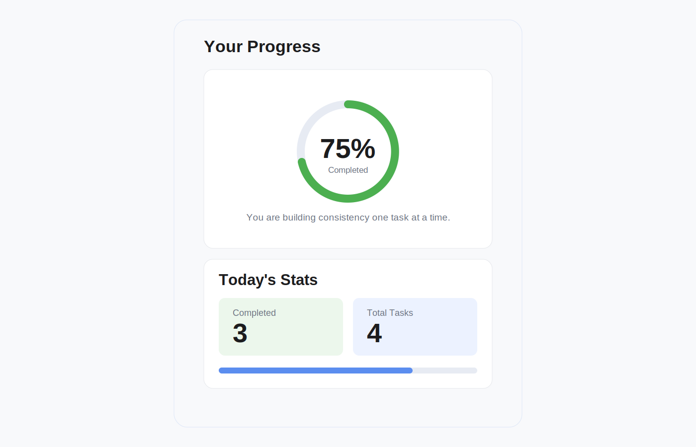
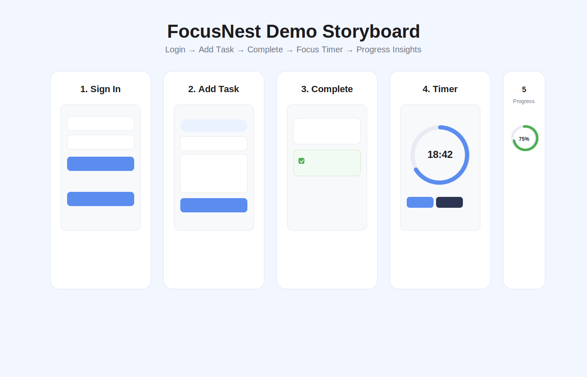

# FocusNest (Study Buddy)

FocusNest is a Flutter productivity app designed for students and self-learners.
It combines task tracking, a Pomodoro-style timer, daily progress insights, and Firebase authentication into a clean multi-platform experience.

This README explains the complete feature set currently implemented in this repository and details the exact technology stack used.

## Table of Contents

- [Product Overview](#product-overview)
- [Feature Walkthrough](#feature-walkthrough)
- [Tech Stack](#tech-stack)
- [Architecture and Data Flow](#architecture-and-data-flow)
- [Project Structure](#project-structure)
- [Local Setup and Run](#local-setup-and-run)
- [Firebase Setup](#firebase-setup)
- [Data Model](#data-model)
- [Contributor Quick Start](#contributor-quick-start)
- [Screenshots and Demo](#screenshots-and-demo)
- [Deployment](#deployment)
- [Current Implementation Notes](#current-implementation-notes)
- [Testing](#testing)
- [Future Enhancements](#future-enhancements)

## Product Overview

FocusNest helps users:

- Authenticate securely (Google or email/password)
- Create, edit, complete, and delete study tasks
- Categorize tasks (Study, Assignment, Revision)
- Build consistency using daily streak tracking
- Run a built-in 25/5 Pomodoro cycle
- Monitor completion progress from a dedicated progress screen

The app is built with Flutter and uses Firebase for authentication.
Task and streak persistence is currently handled locally with SharedPreferences in the active app flow.

## Feature Walkthrough

### 1) Authentication Gate and Session Routing

What it does:

- On launch, Firebase is initialized.
- The app listens to Firebase auth state changes.
- If not authenticated, user is routed to sign-in.
- If authenticated, user sees a splash transition and then the main app.

Why it matters:

- Users always land in the correct screen based on real-time session state.
- Authentication state remains reactive without manual polling.

Implementation highlights:

- Firebase initialization in app startup.
- StreamBuilder-based auth gate.
- Splash transition before entering main navigation.

### 2) Sign In and Account Creation Screen

What it does:

- Supports email/password sign in.
- Supports email/password sign up mode toggle.
- Supports Google sign-in flow.
- Handles web popup-blocked and popup-closed cases with redirect fallback.
- Shows user-friendly error messages for common Firebase auth errors.
- Handles account linking flow when the same email exists with another provider.

Why it matters:

- Users can onboard with preferred auth method.
- Error handling improves reliability and trust.
- Provider-linking avoids dead-end login loops.

Implementation highlights:

- FirebaseAuthException mapping to friendly text.
- Pending credential handling and post-login linking.
- Loading states and disabled buttons while signing in.

### 3) Main Navigation (Tasks / Timer / Progress)

What it does:

- Uses a PageView with a bottom NavigationBar.
- Provides 3 primary tabs:
	- Tasks
	- Timer
	- Progress

Why it matters:

- Keeps workflows separated but quickly accessible.
- Improves usability by preserving per-page structure in one shell.

Implementation highlights:

- PageController for smooth tab animation.
- Selected index sync between swipe and nav tap.

### 4) Task Management (Home Screen)

What it does:

- Displays a daily summary card with completion ratio and progress bar.
- Shows pending task count.
- Supports animated empty state.
- Renders tasks in an AnimatedList.
- Allows add, edit, complete/uncomplete, and delete actions.
- Shows per-task category marker and completion state styling.
- Supports logout from app bar.
- Displays current streak badge when streak is positive.

Why it matters:

- Central productivity workflow is optimized for fast task operations.
- Animated transitions make state changes clear and responsive.

Implementation highlights:

- AnimatedList synchronization logic for insert/remove transitions.
- Completion updates task.completedAt timestamp.
- Completion triggers streak update service.
- Local persistence after every state-changing operation.

### 5) Add/Edit Task Screen

What it does:

- Single form used for both create and edit flows.
- Validates required task title.
- Captures optional task description.
- Allows category selection:
	- Study
	- Assignment
	- Revision

Why it matters:

- Reusing one screen keeps behavior consistent.
- Category tagging enables semantic organization of work.

Implementation highlights:

- Form validation with GlobalKey.
- Task object creation and copyWith-based editing.
- Dynamic labels based on create vs edit mode.

### 6) Study Timer Screen (Pomodoro)

What it does:

- Implements a Pomodoro cycle:
	- 25 minutes focus
	- 5 minutes break
- Supports Start, Pause, and Reset actions.
- Auto-switches between focus and break modes when timer reaches zero.
- Displays circular progress and formatted mm:ss timer text.

Why it matters:

- Encourages deep work sessions and structured breaks.
- Keeps students in a repeatable focus rhythm.

Implementation highlights:

- Timer.periodic tick updates.
- Mode flip logic on completion.
- UI indicators adapt between focus and break states.

### 7) Progress Screen

What it does:

- Shows completion percentage via circular progress indicator.
- Displays daily stats cards:
	- Completed today
	- Total tasks
- Includes linear progress summary.

Why it matters:

- Provides visible feedback loop for daily consistency.
- Helps users monitor short-term outcomes quickly.

Implementation highlights:

- completedToday is computed from task.completedAt date boundaries.
- Progress clamped between 0 and 1 for UI safety.

### 8) Daily Streak Tracking

What it does:

- Stores streak count and last streak date in SharedPreferences.
- Increments streak only once per day when at least one task is completed.
- Continues streak on consecutive days.
- Resets streak when there is a day gap.

Why it matters:

- Reinforces habit formation and daily accountability.

Implementation highlights:

- Date normalization to year/month/day before comparisons.
- Guard against multiple increments on same day.

### 9) Local Persistence

What it does:

- Persists tasks in SharedPreferences as JSON-encoded data.
- Reloads tasks on startup.

Why it matters:

- Users keep their task list between sessions without extra setup.

Implementation highlights:

- Task model supports toMap/fromMap serialization.
- Save operations are called after add/edit/delete/toggle.

### 10) Design System and Visual Identity

What it includes:

- Custom app color system in one place.
- Spacing, radius, and shadow tokens.
- Material 3 light theme.
- Google Fonts (Inter) text theme.
- Reusable custom FocusNest logo widget.

Why it matters:

- Consistent UI language across all screens.
- Faster UI changes through centralized style tokens.

## Tech Stack

### Core Framework

- Flutter (SDK-managed)
- Dart (SDK constraint in pubspec)
- Material 3 UI

### Backend and Cloud

- Firebase Core: app initialization and platform config bootstrap
- Firebase Authentication: email/password + Google login flows
- Cloud Firestore: service layer exists for cloud task storage and streams

### Local Storage

- SharedPreferences:
	- task persistence
	- streak persistence

### UI and UX Libraries

- google_fonts: Inter text theme
- cupertino_icons: iOS style icons

### Tooling and Dev Dependencies

- flutter_test: testing framework
- flutter_lints: lint rules
- flutter_launcher_icons: app icon generation across platforms

### Supported Platforms in Repository

- Android
- iOS
- Web
- Windows
- macOS
- Linux

## Architecture and Data Flow

The app is currently organized with a simple layered structure:

- UI layer: screens and widgets
- Model layer: task data model and category enum
- Service layer:
	- auth service (Firebase Auth)
	- storage service (SharedPreferences)
	- streak service (habit logic)
	- firestore and hybrid storage services (available for expanded cloud sync flow)

High-level runtime flow:

1. App starts and initializes Firebase.
2. Auth gate listens to user session state.
3. Authenticated user enters main navigation shell.
4. Tasks load from local storage.
5. User actions mutate in-memory task list and persist immediately.
6. Completing a task updates streak state.
7. Progress screen derives completion metrics from task data.

## Project Structure

Key directories and files:

- lib/main.dart
	- app entrypoint, auth gate, splash, and main navigation
- lib/screens/
	- home_screen.dart: task dashboard
	- add_task_screen.dart: create/edit form
	- timer_screen.dart: Pomodoro timer
	- progress_screen.dart: completion analytics
	- sign_in_screen.dart: authentication UI
- lib/models/task.dart
	- Task entity and TaskCategory enum
- lib/services/
	- auth_service.dart
	- storage_service.dart
	- streak_service.dart
	- firestore_service.dart
	- hybrid_storage_service.dart
- lib/theme/
	- app_style.dart (design tokens)
	- app_theme_builder.dart (ThemeData)
- lib/widgets/
	- task_tile.dart
	- focus_nest_logo.dart
- firebase.json, firestore.rules, firestore.indexes.json
	- Firebase and Firestore config

## Local Setup and Run

### Prerequisites

- Flutter SDK installed
- Dart SDK (included with Flutter)
- Firebase project configured for your target platform(s)
- Chrome or device/emulator for running the app

### Installation

1. Clone this repository.
2. Install packages:

	 flutter pub get

3. Ensure Firebase config files are present (see Firebase Setup section).

### Run

- Web (Chrome):

	flutter run -d chrome

- Android/iOS/Desktop:

	flutter run

## Firebase Setup

This project uses Firebase initialization via lib/firebase_options.dart.

Recommended setup steps:

1. Create/select a Firebase project.
2. Register each target app (Android/iOS/Web/etc.).
3. Add platform config files:
	 - Android: android/app/google-services.json
	 - iOS: ios/Runner/GoogleService-Info.plist
4. Generate firebase options with FlutterFire CLI:

	 flutterfire configure

5. In Firebase Authentication:
	 - Enable Email/Password provider
	 - Enable Google provider
	 - For Web, add authorized domains

Firestore security in this repo currently requires authentication for all reads/writes.

## Data Model

Task fields:

- id: unique string ID
- title: required task title
- description: optional text
- category: study | assignment | revision
- isCompleted: boolean
- createdAt: DateTime
- completedAt: nullable DateTime

Serialization support:

- toMap for persistence
- fromMap for restoration

## Contributor Quick Start

This section is for developers who want to contribute quickly without reading every file first.

### 1) Environment Setup

1. Install Flutter stable channel.
2. Run Flutter doctor and fix any issues:

	flutter doctor

3. Install project dependencies:

	flutter pub get

4. Configure Firebase for your platform using FlutterFire CLI:

	flutterfire configure

### 2) Typical Daily Workflow

1. Pull latest changes.
2. Create a feature branch.
3. Run and verify app locally:

	flutter run -d chrome

4. Run static analysis and tests before committing:

	flutter analyze
	flutter test

### 3) Where to Make Changes

- Add new screen/page logic in lib/screens/
- Add reusable components in lib/widgets/
- Add persistence/auth/business logic in lib/services/
- Update design tokens in lib/theme/app_style.dart
- Update app-wide theming in lib/theme/app_theme_builder.dart

### 4) Contribution Checklist

- Keep UI and behavior consistent with existing design system.
- Reuse existing services before introducing new abstractions.
- Add or update tests for non-trivial behavior.
- Keep README and setup docs in sync with feature changes.

## Screenshots and Demo

Use this section to showcase the app UI and core workflows.

### Suggested Screenshots

- Sign In screen
- Home Tasks screen (with and without tasks)
- Add/Edit Task screen
- Timer screen during focus mode
- Progress screen with daily stats

### Current Rendered Previews

The repository now includes realistic rendered preview images in assets/docs/:

### Demo Preview

A storyboard-style demo preview is included:

Recommended sequence for a future animated GIF export:

1. Login
2. Add task
3. Complete task
4. Open timer and start/pause/reset
5. Open progress tab

## Deployment

This section covers practical release preparation for Web, Android, and iOS.

### Web Deployment

Build command:

flutter build web

Output folder:

- build/web

Hosting options:

- Firebase Hosting
- Netlify
- Vercel
- GitHub Pages (with SPA fallback config)

If using Firebase Hosting:

1. Install Firebase CLI.
2. Login and initialize hosting.
3. Set public directory to build/web.
4. Deploy:

	firebase deploy

### Android Release (Play Store Prep)

Build app bundle:

flutter build appbundle

Checklist:

- Confirm applicationId and versioning in android/app/build.gradle.kts
- Configure signing key and key.properties securely
- Verify firebase config file exists for release
- Test release build on physical device
- Prepare Play Store listing assets and privacy policy URL

Artifact for upload:

- build/app/outputs/bundle/release/app-release.aab

### iOS Release (TestFlight Prep)

Build iOS release:

flutter build ios --release

Checklist:

- Open ios/Runner.xcworkspace in Xcode
- Set correct Bundle Identifier and Team
- Ensure GoogleService-Info.plist is added to Runner target
- Configure signing and capabilities
- Archive and upload to App Store Connect
- Distribute via TestFlight

### Pre-Release Validation

Before any production release:

1. flutter analyze
2. flutter test
3. Smoke test auth flows (email + Google)
4. Verify task CRUD + streak behavior
5. Verify timer transitions (focus to break)
6. Verify Firebase auth domain/provider settings for target platform

## Current Implementation Notes

Important implementation details to know:

- Active task persistence path in app runtime uses StorageService (SharedPreferences).
- FirestoreService and HybridStorageService exist in the codebase for cloud-oriented extensions, but are not currently wired into main.dart runtime flow.
- hybrid_storage_service.dart contains placeholder JSON encode/decode methods that should be hardened before production usage.
- Streak updates occur when a task is marked completed, with same-day duplicate increment protection.

## Testing

Run tests with:

flutter test

Current repository includes a default widget test scaffold.

## Future Enhancements

Potential next improvements:

- Wire HybridStorageService into main flow for optional cloud sync toggle.
- Add offline-first bidirectional sync conflict handling.
- Add reminders/notifications for focus sessions and tasks.
- Add richer analytics (weekly trends, category breakdowns).
- Expand test coverage for services and screen interactions.
